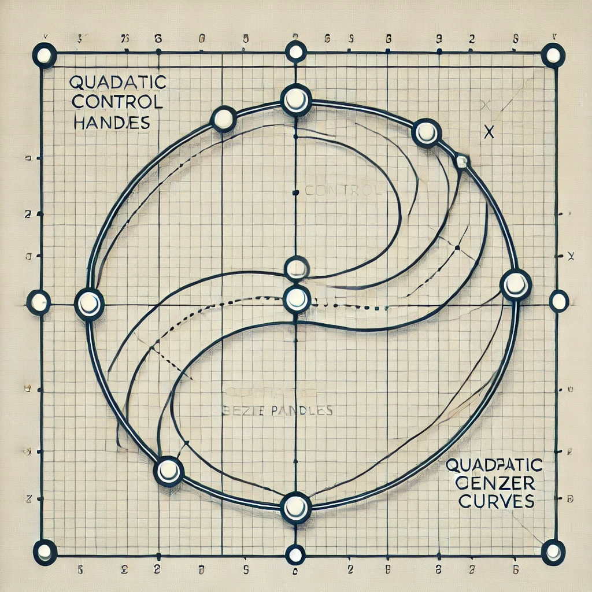

# BezierShape Class

The `BezierShape` class provides methods to create, transform, and render shapes using quadratic Bezier curves.

## Example Usage

```typescript
const shape = new BezierShape();
shape.addPoint([100, 100]);
shape.addPoint([200, 200], {
  quadraticHandle: { vec: [0.5, 0.5], size: 50 },
});

const canvas = document.createElement('canvas');
const ctx = canvas.getContext('2d')!;
shape.draw(ctx, { strokeColor: 'blue', strokeWidth: 2, debug: true });
```


